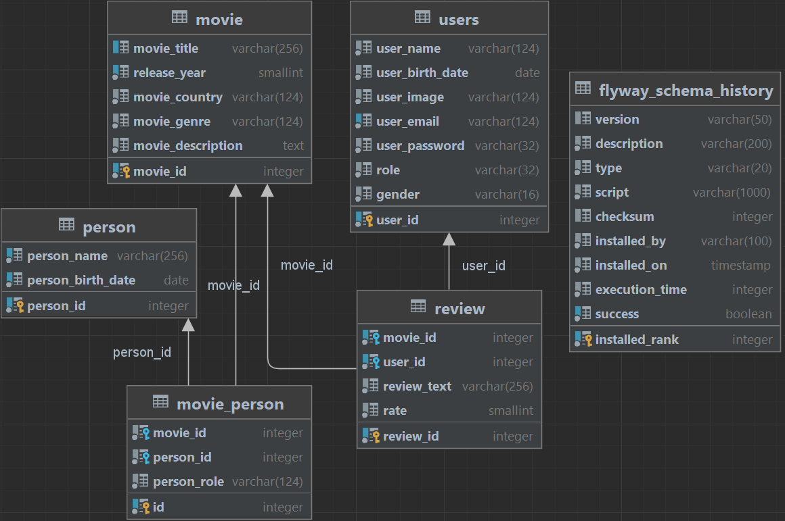

# Video Library

This is a pet project.
In this project I wanted to show my work with the following technologies/tools:

- Java 21
- Servlets
- JSP, JSTL
- JDBC
- Postgres
- Maven
- Flyway
- Lombok
- Docker
- JUnit5 (Mockito, AssertJ)
- H2 Database
- Jacoco
- Git

## Prerequisites

On you machine you must have:

- Java 21 or higher
- Docker - for application start

## How to get and run application

**First, make sure you have Docker up and running, and also that ports 8080 and 5432 are free.**

The following set of commands will clone the project from GitHub repo and
set permissions to execute start-app and stop-app scripts.

````
git clone git@github.com:Davydovskyi/video-library-servlets.git
cd video-library-servlets
chmod +x start-app
chmod +x stop-app
````

To start the app, run the following script.
It will build the project, start docker containers for postgres and video-library and set up a network
between them. Then it will run migration scripts to create and fill out database tables,
and after that it will automatically open video-library start page in the browser under
the localhost.

````
./start-app
````

To stop docker containers for Postgres and Video Library and remove network between them, run the cleanup script:

````
./stop-app
````

There are two predefined users that you can use:

- Admin - login: admin@gmail.com, password: **99887766**
- User - login: user1@gmail.com, password: **12345678**

## Key features

- This application is a movie catalog with a following functionality:
    - All users:
        - Filter movies using various filter options
        - Download search results as a CSV file
        - View detailed information about films, including film participants (actors/directors/producers/composers) and
          user reviews
        - View detailed information about the film's participants (list of each participant's other projects, etc.)
        - Adding reviews for movies
        - View reviews from a specific user
    - Admins only:
        - Adding new movies to the library
        - Adding new movie participants
- Login/registration/logout are available
- There is localization available for three languages: `English` and `Russian`

## Database structure



#### Test Coverage - 91% (Unit and Integration tests)